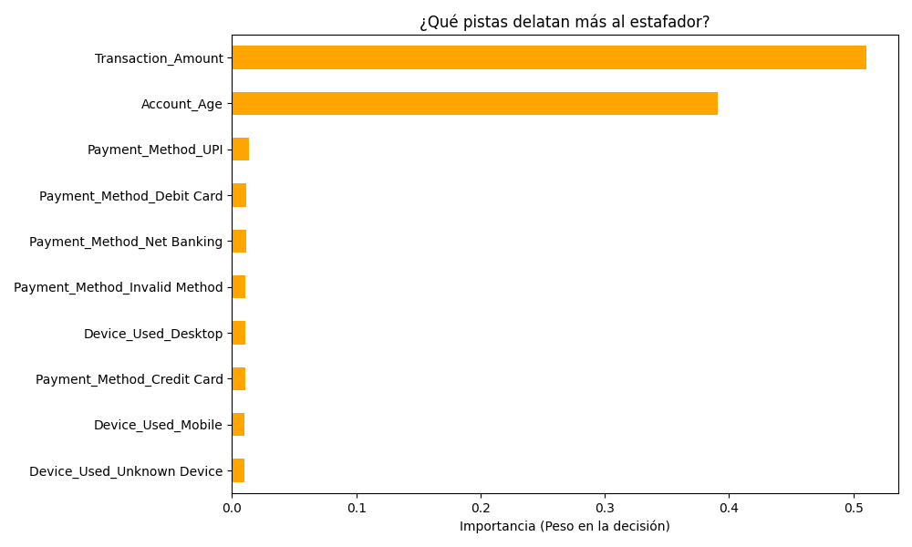

# 🏦 Detección de Fraude en Pagos Digitales: Un Enfoque de Ciberseguridad

### 🕵️ El Desafío del Negocio
En la era de los pagos instantáneos (UPI) y las transacciones móviles, las instituciones financieras enfrentan pérdidas millonarias por fraudes imperceptibles. En este proyecto de 51,000 registros, el objetivo fue "cazar" patrones criminales ocultos.

### 🔍 Hallazgos Forenses de Alto Impacto
*   **Vulnerabilidad Crítica:** Identificamos que el **5.14%** de las operaciones por **UPI** son fraudulentas.
*   **Punto de Ataque:** El canal **Mobile** concentra el mayor volumen de robos (**806 casos**), sugiriendo brechas en la seguridad de la App.
*   **Anatomía del Robo:** Los estafadores operan en una "zona de confort" de montos cercanos a los **$3,118**, evitando alertas tempranas, aunque se detectaron picos de hasta **$49,000**.

### 📊 Evidencia de Inteligencia
#### 1. Riesgo por Método de Pago

#### 2. Volumen de Ataques por Dispositivo (Predominio Móvil)

*Hallazgo: El canal móvil concentra el 33.5% de los fraudes totales, confirmando una brecha de seguridad en la aplicación.*

#### 2. Concentración de Montos (Histograma de Crimen)

### 🤖 Inteligencia Artificial: El "Radar" de Seguridad
Para enfrentar el desbalance extremo de los datos (solo 0.2% de fraude), implementamos un modelo de **Random Forest** con pesos balanceados, logrando resultados de élite:

*   **Capacidad de Detección (Recall): 94%**. Identificamos a 94 de cada 100 estafadores. 🛡️
*   **Poder Predictivo:** El modelo prioriza la seguridad, prefiriendo una alerta preventiva antes que una pérdida financiera.

#### 🧠 ¿Qué "huele" la IA para detectar al criminal?

*Análisis Técnico: El **Monto de la Transacción** y la **Antigüedad de la Cuenta** representan el 90% de la importancia. Esto confirma que el fraude es oportunista y busca el máximo beneficio en cuentas con poco historial.*

---

### 💡 Recomendación Estratégica (ROI)
**"Basado en el Recall del 94%, recomiendo implementar un protocolo de Autenticación Multifactor (MFA) para transacciones que superen los $2,500 y un límite de 'enfriamiento' para cuentas de menos de 30 días, atacando así los dos pilares que delatan al estafador."**
