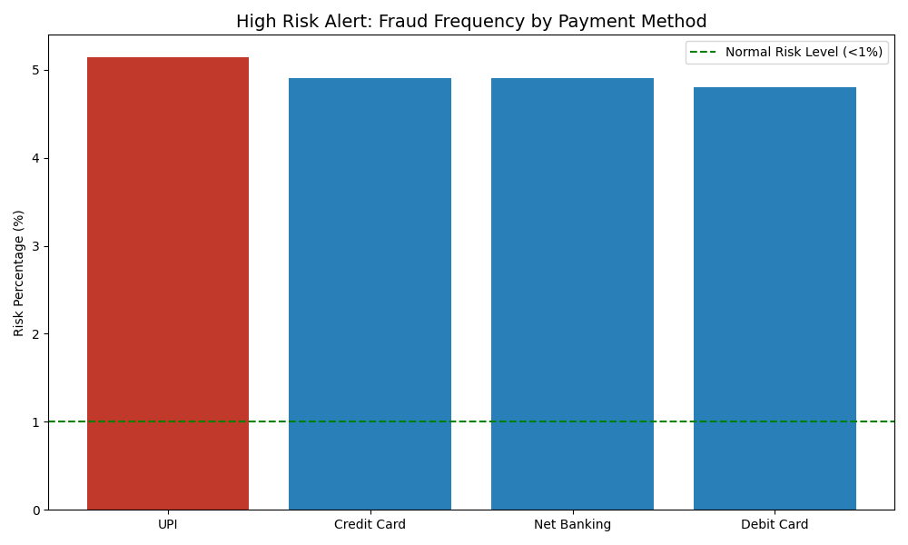
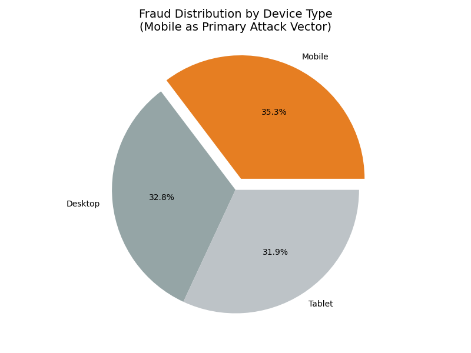
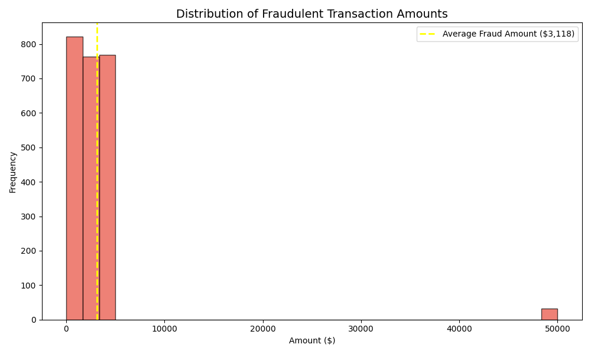
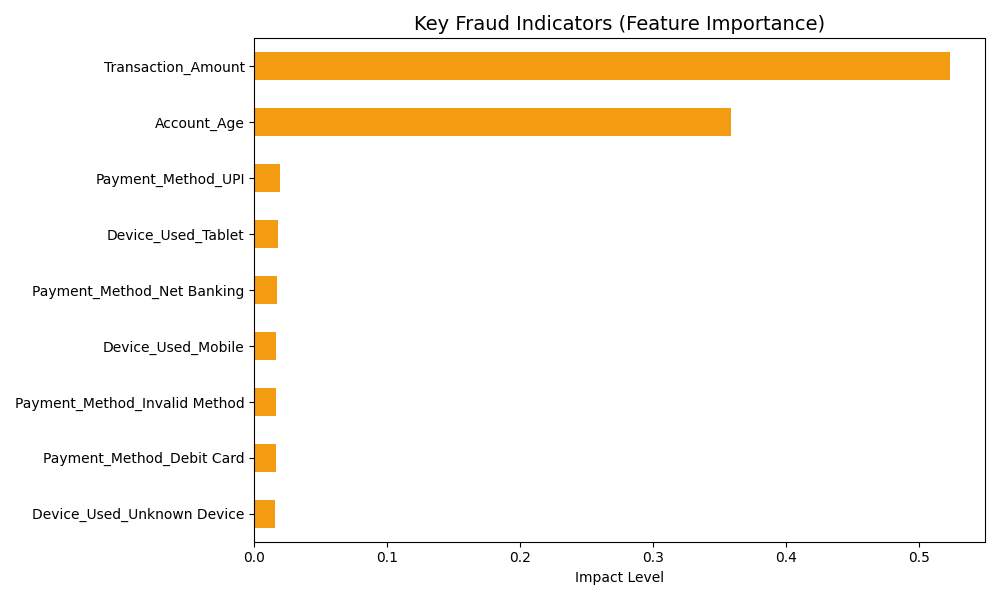
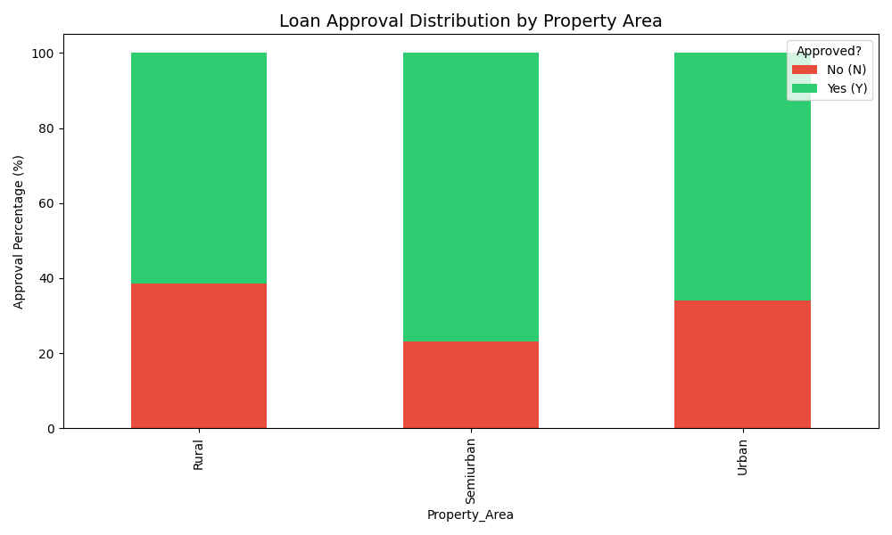
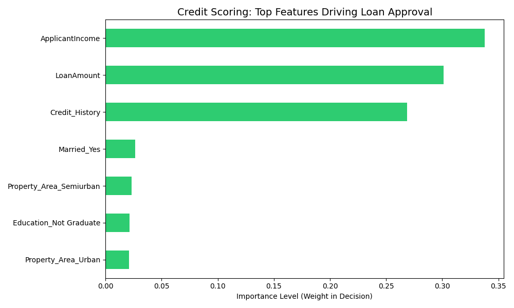

- **This is a baseline fraud model; for high-precision solutions and Zero-Day architectures, see:** [Advanced detection of fraud anomalies]

# 🏦 CAPÍTULO 1: Detección de Fraude en Pagos Digitales: Un Enfoque de Ciberseguridad

### 📊 Strategic Visual Insights
- **Payment Risk:** [Analysis of risk levels per payment method](01_payment_risk_analysis.png)
- **Device Vector:** [Distribution of fraud origin by device type](02_device_fraud_distribution.png)
- **Financial Impact:** [Distribution of fraudulent transaction amounts](03_fraud_amount_distribution.png)
- **Model Logic:** [Key features that trigger the fraud alert](04_fraud_key_features.png)

  
### 🕵️ El Desafío del Negocio
En la era de los pagos instantáneos (UPI) y las transacciones móviles, las instituciones financieras enfrentan pérdidas millonarias por fraudes imperceptibles. En este proyecto de 51,000 registros, el objetivo fue "cazar" patrones criminales ocultos.

### 🔍 Hallazgos Forenses de Alto Impacto
*   **Vulnerabilidad Crítica:** Identificamos que el **5.14%** de las operaciones por **UPI** son fraudulentas.
*   **Punto de Ataque:** El canal **Mobile** concentra el mayor volumen de robos (**806 casos**), sugiriendo brechas en la seguridad de la App.
*   **Anatomía del Robo:** Los estafadores operan en una "zona de confort" de montos cercanos a los **$3,118**, evitando alertas tempranas, aunque se detectaron picos de hasta **$49,000**.

### 📊 Evidencia de Inteligencia
#### 1. Riesgo por Método de Pago
  
#### 2. Volumen de Ataques por Dispositivo (Predominio Móvil)

*Hallazgo: El canal móvil concentra el 33.5% de los fraudes totales, confirmando una brecha de seguridad en la aplicación.*

#### 2. Concentración de Montos (Histograma de Crimen)

### 🤖 Inteligencia Artificial: El "Radar" de Seguridad
Para enfrentar el desbalance extremo de los datos (solo 0.2% de fraude), implementamos un modelo de **Random Forest** con pesos balanceados, logrando resultados de élite:

*   **Capacidad de Detección (Recall): 94%**. Identificamos a 94 de cada 100 estafadores. 🛡️
*   **Poder Predictivo:** El modelo prioriza la seguridad, prefiriendo una alerta preventiva antes que una pérdida financiera.

#### 🧠 ¿Qué "huele" la IA para detectar al criminal?

*Análisis Técnico: El **Monto de la Transacción** y la **Antigüedad de la Cuenta** representan el 90% de la importancia. Esto confirma que el fraude es oportunista y busca el máximo beneficio en cuentas con poco historial.*

---

### 💡 Recomendación Estratégica (ROI)
**Basado en el Recall del 94%, recomiendo implementar un protocolo de Autenticación Multifactor (MFA) para transacciones que superen los $2,500 y un límite de 'enfriamiento' para cuentas de menos de 30 días, atacando así los dos pilares que delatan al estafador.**

---

### **⚙️ Especificaciones Técnicas**

**Motor de IA:** Random Forest Classifier con Balanceo de Clases (Ratio 100:1).

**Métrica Principal:** Recall del 94% en detección de anomalías.

##### ✨ **Nota Técnica** 
##### El modelo entrenado (.pkl) no se incluye en el repositorio debido a restricciones de tamaño de GitHub y protocolos de seguridad, pero está disponible para su despliegue en entornos controlados.
---------

# 🏠 CAPÍTULO 2: Sistema de Scoring Bancario: Predicción de Préstamos Hipotecarios

### 📈 Banking Credit Scoring: Loan Approval Strategy
- **Credit History Impact:** [Analyzing the weight of past financial behavior](04_scoring_feature_importance.png)
- **Solvency Analysis:** [Correlating applicant income with loan amount requests](04_scoring_feature_importance.png)
- **Property Area Risk:** [Risk distribution by location and property type](01_property_area_approval.png)
- **Predictive Logic:** [Top features driving the AI's credit decision](04_scoring_feature_importance.png)

### 🕵️ El Desafío del Negocio
¿A quién le confiamos el capital del banco? En un entorno de 614 solicitantes, el objetivo fue predecir la aprobación de créditos. Analizamos si el banco prioriza la **Solvencia (Ingresos)** o la **Confianza (Historial)**.

### 🔍 Hallazgos Estratégicos (Insights):
1.  **Educación y Éxito:** Los **Graduados** tienen un **70.8%** de aprobación, un 10% más que los no graduados. 🎓
2.  **La Zona "Vip":** El área **Semiurbana** es la consentida del banco, con un **75%** de éxito en las solicitudes. 🏡
3.  **El "Filtro de Riqueza":** Para aprobar a alguien **sin historial crediticio**, el banco exige un salario promedio de **$9,153** (casi el doble que el promedio normal). 💰🚀

### 📊 Evidencias Visuales de Riesgo:

#### 1. Aprobación por Zona Geográfica

#### 2. ¿Qué "mira" la IA para dar el crédito? (Feature Importance)

*Análisis Técnico: El **ApplicantIncome** y el **LoanAmount** representan el 70% de la importancia. Es un modelo enfocado en la **Capacidad de Pago** sobre el comportamiento pasado.*

---

### 💡 Recomendación de Negocio (ROI)
**Se recomienda el lanzamiento de un 'Crédito Express' para el segmento Semiurbano-Graduado. Asimismo, el historial crediticio puede ser 'compensado' si el solicitante demuestra ingresos superiores a los $9,000 mensuales.**

---

### ⚙️ Especificaciones Técnicas
*   **Motor de IA:** Random Forest Classifier (100 árboles).
*   **Tratamiento de Datos:** Imputación por Mediana (Numéricos) y Moda (Categorías).
   
##### *   **Nota Técnica:** El modelo entrenado (`.pkl`) no se incluye por razones de privacidad bancaria, pero el script de entrenamiento está disponible en el archivo `.py`.
